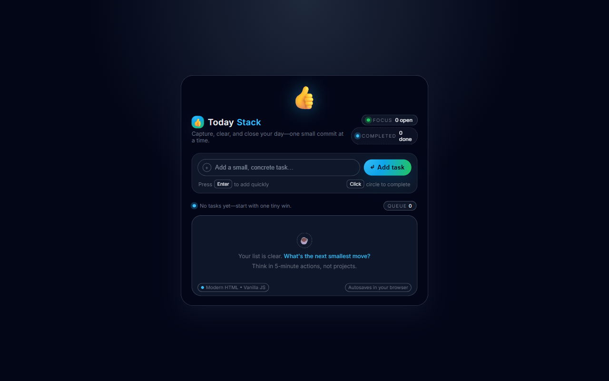

# TodayStack

A static, zero-dependency to-do list web app. Pure HTML + CSS + vanilla JS — no framework, no bundler, no package manager. Tasks autosave to `localStorage` under the key `modern_todo_tasks_v1`, so your list survives a refresh. Hosted on GitHub Pages.

**Live site:** https://clemhuang-sys.github.io/first-clude-app/

## Run locally

Open [index.html](index.html) directly in a browser, or use VS Code Live Server for auto-reload. There is no build, lint, or test step.

## Deploy

Push to `master`. The [.github/workflows/deploy.yml](.github/workflows/deploy.yml) workflow uploads the repo root as a Pages artifact and deploys via `actions/deploy-pages`. CDN propagation can take up to a minute; hard-refresh (`Ctrl+Shift+R`) when verifying.

## Files

- [index.html](index.html) — markup
- [styles.css](styles.css) — dark-themed design system driven by CSS custom properties
- [script.js](script.js) — state, rendering, and a single delegated click handler on the task list
