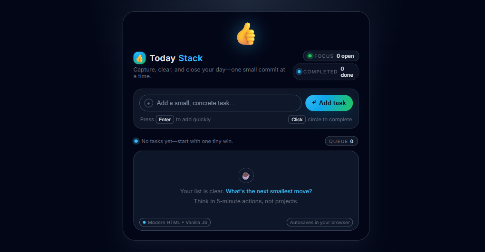

# TodayStack

A static, zero-dependency to-do list web app. Pure HTML + CSS + vanilla JS — no framework, no bundler, no package manager.

**Live site:** https://clemhuang-sys.github.io/first-clude-app/

## Features

- Add, complete, and delete tasks
- Persistent storage via `localStorage` (survives page reloads)
- Live summary: total, remaining, and completed counts
- Dark-themed, responsive UI

## Run locally

Open [index.html](index.html) directly in a browser, or use VS Code Live Server for auto-reload. There is no build step.

## Project structure

- [index.html](index.html) — markup and element IDs queried by the script
- [styles.css](styles.css) — design system driven by CSS custom properties on `:root`
- [script.js](script.js) — state management, rendering, and event delegation; persists to `localStorage` under key `modern_todo_tasks_v1`

## Deployment

Pushes to `master` trigger [.github/workflows/deploy.yml](.github/workflows/deploy.yml), which uploads the repo root as a GitHub Pages artifact and deploys it. CDN propagation can take up to a minute — hard-refresh (`Ctrl+Shift+R`) when verifying.
